==================================
Bitstream Evolution's Architecture
==================================

The origional code was designed in a vaguely class-like structure to prove the concept, but once proven it became very challenging to change the code and coordinate those changes, even in a small group.
Thus, we created the following general architecture to make the code more modular and easy to edit and use for a broader range of applications.

General Structure
=================

Below is the best current description of our architecture. It is currently pretty in-line with the initial proposal.

.. image:: images/initial_proposal/Arch_Proposal-7.png
    

Initial Proposal
================

Below are a series of slides from the initial proposal for the Archatecture. These are non-final, but were going in the right direction.

To see this as the origional presentation, `look here <https://docs.google.com/presentation/d/1QkHsh1EmpQeNTC4FLra8Vry-5Ln28tJxNxoWPVK5R3A/edit?usp=sharing>`_.

I then attempted to implement a basic example of it in the TrivialImplementation.py file.

Architecture Description
------------------------

.. image:: images/initial_proposal/Arch_Proposal-1.png

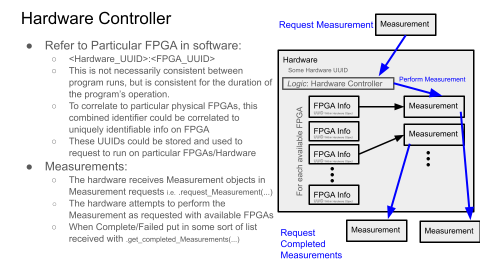

.. image:: images/initial_proposal/Arch_Proposal-3.png
    
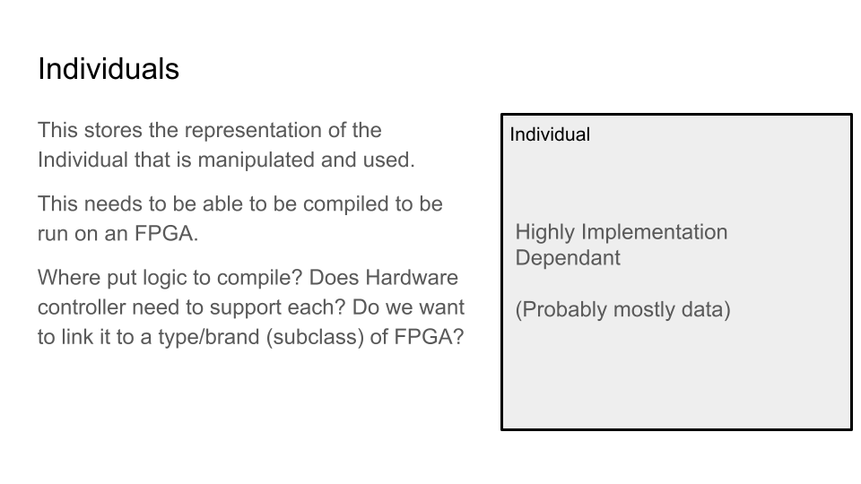
    
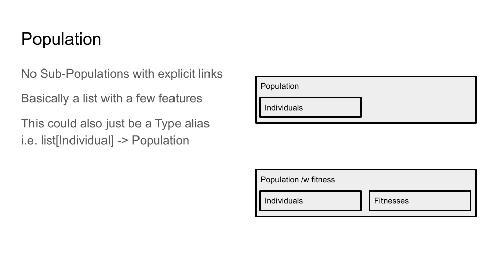
    
.. image:: images/initial_proposal/Arch_Proposal-6.png
    
.. image:: images/initial_proposal/Arch_Proposal-7.png
    
.. image:: images/initial_proposal/Arch_Proposal-8.png
    
.. image:: images/initial_proposal/Arch_Proposal-9.png
    
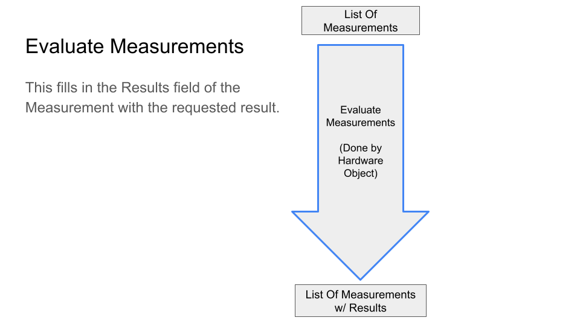
    
.. image:: images/initial_proposal/Arch_Proposal-11.png
    
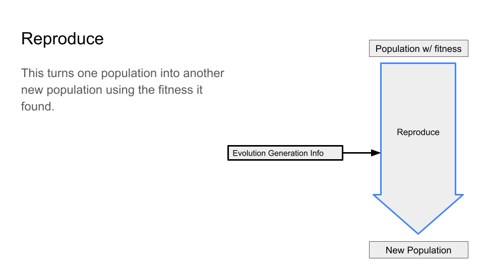
    
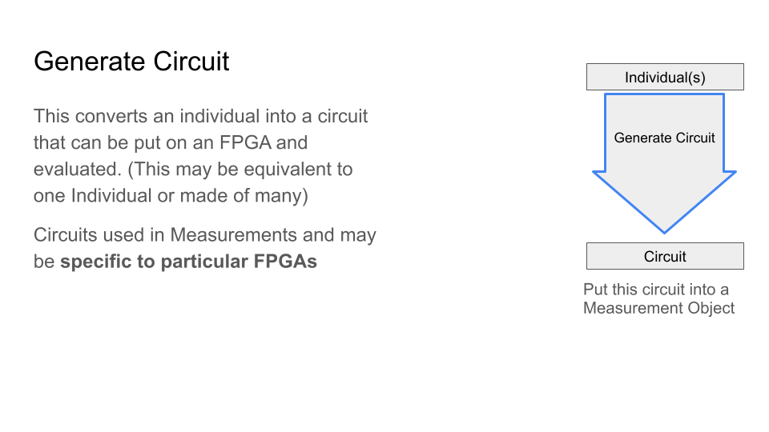
    
Architectural Example
---------------------

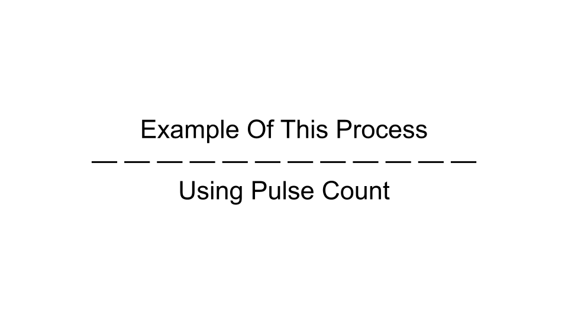
    
.. image:: images/initial_proposal/example/Arch_Example-2.png
    
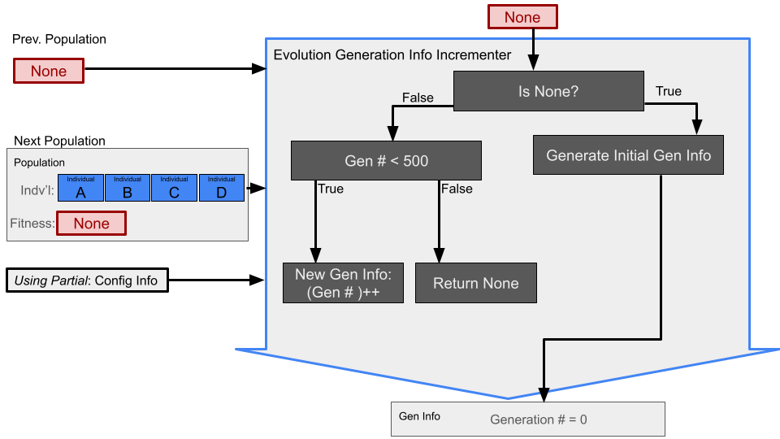
    
.. image:: images/initial_proposal/example/Arch_Example-4.png
    
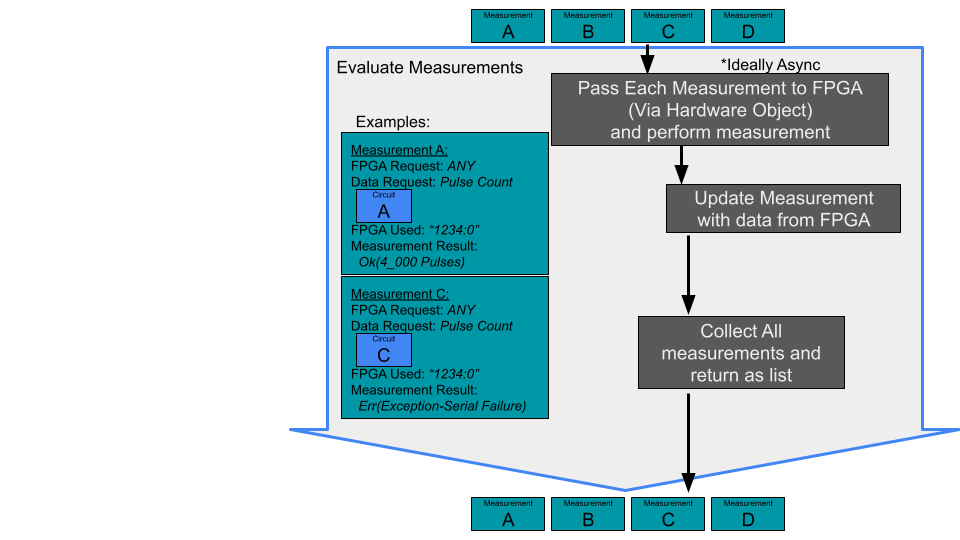
    
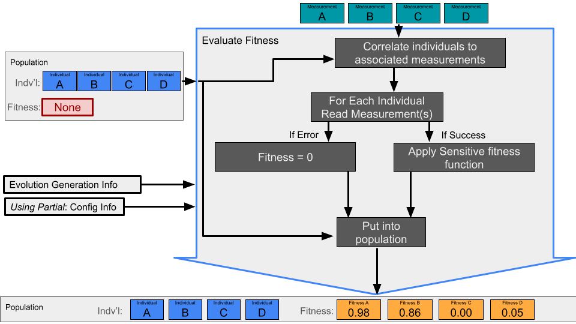
    
.. image:: images/initial_proposal/example/Arch_Example-7.png
    
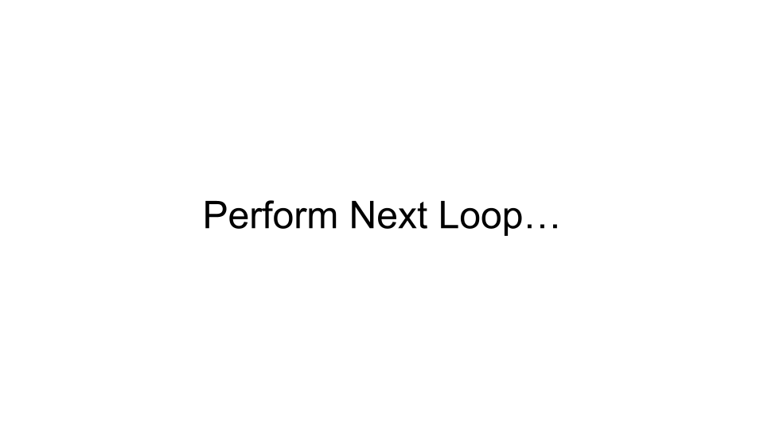
    
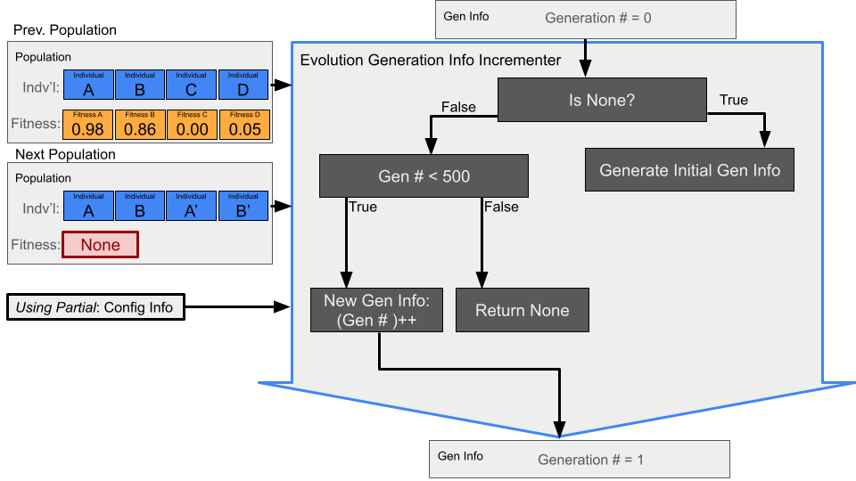
    
.. image:: images/initial_proposal/example/Arch_Example-10.png
    
.. image:: images/initial_proposal/example/Arch_Example-11.png
    
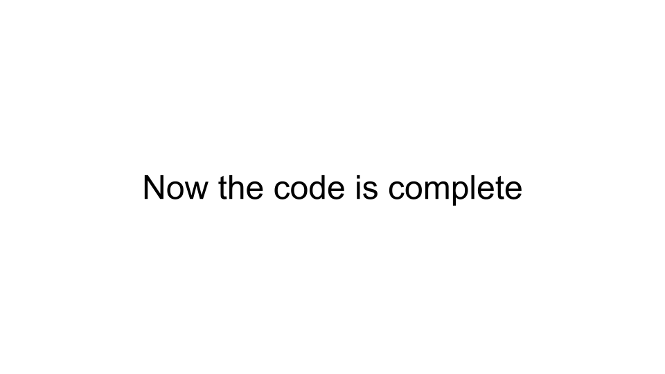
    

Early Design Ideas
==================

Below is one of the early attempts at conceptualizing an architecture for this project:

.. image:: images/EarlyDesignIdea.png
